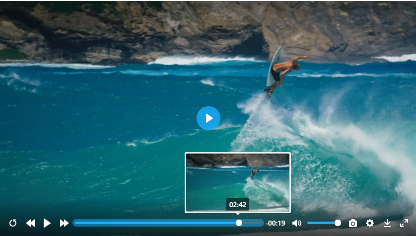

# plyr-plugin-thumbnail
a easy to use preview thumbnail plugin of plyr player,not use the default preview thumbnail with vtt files


[demo](https://zengde.github.io/plyr-plugin-thumbnail/)



# Use
1.use modern browser 

2.add plyr-plugin-thumbnail.js after main plyr js
```html
<script src="path/to/plyr.js"></script>
<script src="path/to/plyr-plugin-thumbnail.js"></script>
<script>
    const player = new Plyr('#player');
</script>
```

3.add thumbnail config
```
// your other configs
thumbnail:{
    enabled:true,
    pic_num: 184,// total thumbnail numbers
    width: 178,// per thumbnail item width
    height: 100,// per thumbnail item height
    col: 7,// per thumbnail image columns
    row: 7,// per thumbnail image rows
    offsetX:0,
    offsetY:0,
    urls: ['https://cdn.plyr.io/static/demo/thumbs/100p-00001.jpg',
    'https://cdn.plyr.io/static/demo/thumbs/100p-00002.jpg',
    'https://cdn.plyr.io/static/demo/thumbs/100p-00003.jpg',
    'https://cdn.plyr.io/static/demo/thumbs/100p-00004.jpg'] // thumbnail images
},
```

4.mouse hover to progress to see preview image

# Other Plugins
1. [video capture](https://github.com/zengde/plyr-plugin-capture)
2. [preview thumbnails](https://github.com/zengde/plyr-plugin-thumbnail)
3. [generate thumbnail files](https://github.com/zengde/plyr-thumbnail-gerate)